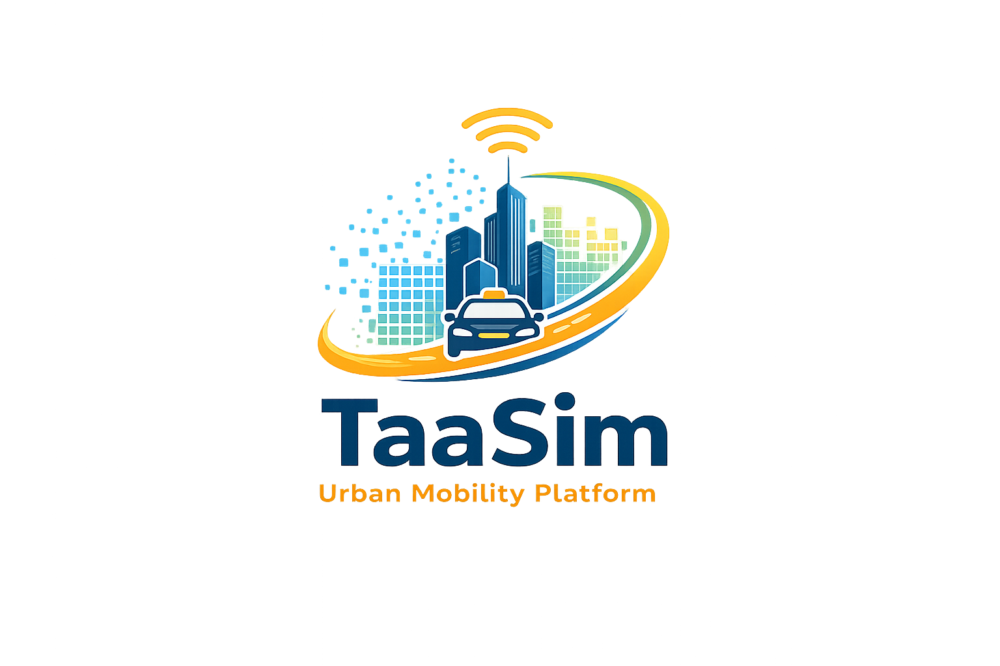
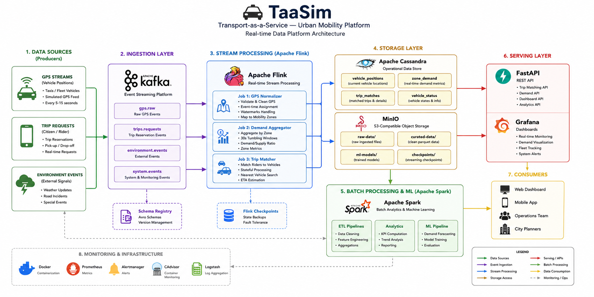
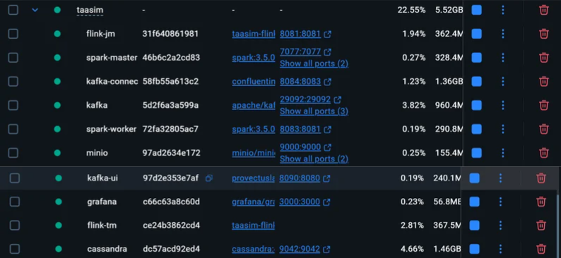
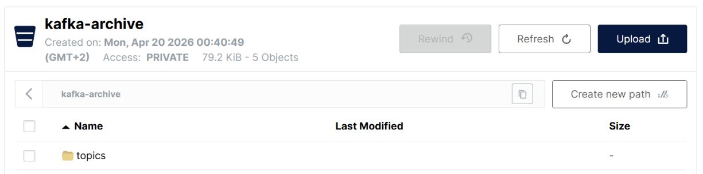
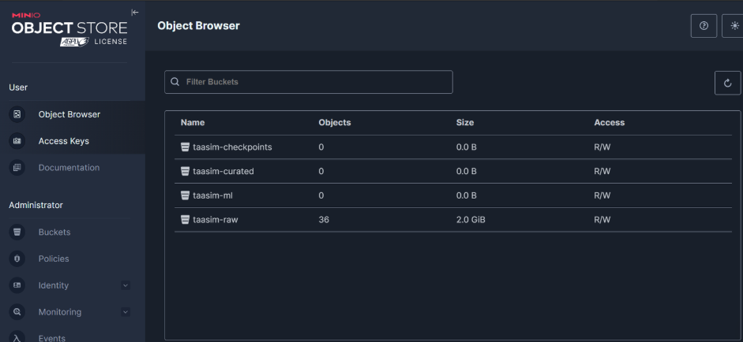

# TaaSim — Real-Time Urban Mobility Data Platform



> Event-driven Transport-as-a-Service platform for Casablanca urban mobility simulation.

TaaSim is a distributed Big Data platform designed to simulate and optimize urban transportation systems using real-time stream processing, batch analytics, and machine learning.

The project combines Apache Kafka, Flink, Spark, Cassandra, and FastAPI to process GPS streams, match riders to vehicles, aggregate mobility demand, and forecast transportation patterns at city scale.

---

## Architecture Overview



### Core Pipeline

```text
GPS Producers / Trip Requests
            ↓
         Apache Kafka
            ↓
      Apache Flink Jobs
            ↓
 Apache Cassandra + MinIO
            ↓
    FastAPI + Grafana
```

---

## Key Features

- Real-time GPS stream processing using Apache Flink
- Event-time processing with watermark handling
- Low-latency trip matching engine
- Demand aggregation by mobility zone
- Distributed batch ETL pipelines with Apache Spark
- Demand forecasting using Spark MLlib
- Cassandra serving layer optimized for mobility queries
- Kafka-based event-driven architecture
- Grafana operational dashboards
- Dockerized infrastructure

---

## Technology Stack

| Layer | Technologies |
|---|---|
| Streaming | Apache Kafka, Apache Flink |
| Batch Processing | Apache Spark, PySpark |
| Storage | Cassandra, MinIO |
| API | FastAPI |
| Visualization | Grafana |
| Infrastructure | Docker, Docker Compose |
| ML | Spark MLlib |
| Languages | Python, SQL |

---

# System Architecture

TaaSim follows a Kappa Architecture approach where Kafka acts as the central event backbone.

Historical and real-time events are processed through the same streaming pipeline, enabling unified event handling and replayability.

## Main Components

### Kafka
Acts as the distributed event bus for:
- GPS streams
- Trip reservation events
- Demand aggregation outputs
- Match events

### Flink
Responsible for:
- GPS normalization
- Event-time processing
- Watermark management
- Demand aggregation
- Stateful trip matching

### Spark
Used for:
- Historical ETL pipelines
- Large-scale analytics
- Feature engineering
- ML model training

### Cassandra
Serves as the low-latency operational database optimized around mobility query patterns.

### MinIO
Provides S3-compatible object storage for:
- Raw datasets
- Curated parquet datasets
- ML artifacts
- Checkpoints

---

# Streaming Pipeline

## Flink Job 1 — GPS Normalizer

Processes raw GPS events by:
- validating coordinates
- assigning event-time watermarks
- deduplicating noisy events
- mapping vehicles to mobility zones

Outputs:
- `vehicle_positions`
- `processed.gps`

---

## Flink Job 2 — Demand Aggregator

Aggregates:
- active vehicles
- pending trip requests

using 30-second tumbling windows.

Outputs:
- live zone demand metrics
- demand/supply ratios

---

## Flink Job 3 — Trip Matcher

Matches:
- incoming rider requests
- nearest available vehicles

Features:
- stateful processing
- fallback zone expansion
- ETA estimation

---

# Machine Learning Pipeline

The ML module forecasts transportation demand per mobility zone using Spark MLlib.

## Prediction Target

Predict:
- number of trip requests
- per 30-minute time slot
- for each mobility zone

## Features

- hour of day
- day of week
- demand lag features
- rolling averages
- weather indicators
- zone metadata

## Model

Gradient Boosted Trees Regressor using Spark MLlib.

---

# Data Engineering Concepts Covered

This project explores several advanced data engineering concepts:

- Event-driven architectures
- Stateful stream processing
- Event-time vs processing-time
- Watermarks and late events
- Distributed storage systems
- Data lake architecture
- NoSQL schema design
- Stream-to-batch integration
- Real-time analytics
- ML pipelines at scale

---

# Repository Structure

```text
taasim_project/
├── architecture/
├── docker/
├── flink/
├── spark/
├── api/
├── zone_remapping/
├── images/
├── data
├── producers/
├── grafana/
├── notebooks/
├── docs/
└── screenshots/
```

---

# Current Status

TaaSim is currently under active development.

### Completed
- Initial architecture design
- Kafka infrastructure setup
- Dockerized environment
- Cassandra schema design
- Dataset exploration
- GPS simulation prototype

### In Progress
- Flink GPS normalization
- Demand aggregation
- Trip matching engine

### Planned
- ML forecasting pipeline
- Dynamic pricing
- Advanced anomaly injection
- SLA benchmarking

---

# Datasets

## Porto Taxi Trajectories
Used for:
- GPS simulation
- mobility demand patterns
- real-time event replay

## NYC TLC Trip Records
Used for:
- Spark ETL
- large-scale analytics
- ML training

---

# Engineering Decisions

## Why Kappa Architecture?

A Kappa architecture simplifies the platform by unifying historical replay and live event processing through Kafka.

## Why Cassandra?

The operational layer requires:
- high write throughput
- low-latency zone queries
- scalable partitioning

Cassandra is optimized around these access patterns.

## Why Event-Time Processing?

GPS events may arrive out-of-order due to:
- network delays
- simulated blackouts
- late arrivals

Flink watermarks ensure accurate aggregations despite delayed events.

---

# Scalability Goals

- < 5s trip matching latency
- 30s demand aggregation windows
- scalable event ingestion
- distributed ETL on millions of trips
- fault-tolerant streaming jobs

---

# Future Improvements

- Dynamic pricing engine
- Real-time route optimization
- Driver earnings analytics
- Schema Registry integration
- Kubernetes deployment
- Multi-broker Kafka cluster
- Real geospatial indexing

---

# Screenshots

## Infrastructure

### Docker Services


### Kafka Topics


### MinIO Buckets


---

# Learning Outcomes

Through TaaSim, we explored:

- distributed systems design
- stream processing architectures
- real-time data engineering
- batch + streaming integration
- ML systems engineering
- scalable backend infrastructure

---

# Authors

Developed as part of the Advanced Big Data Capstone Project.