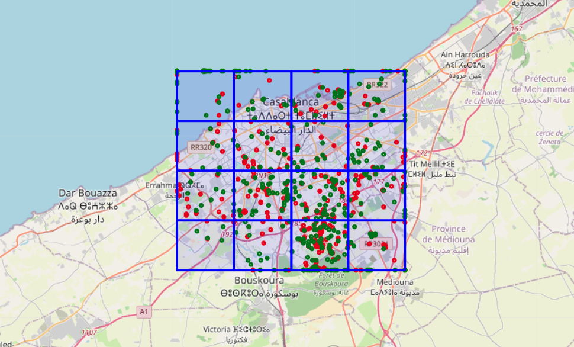
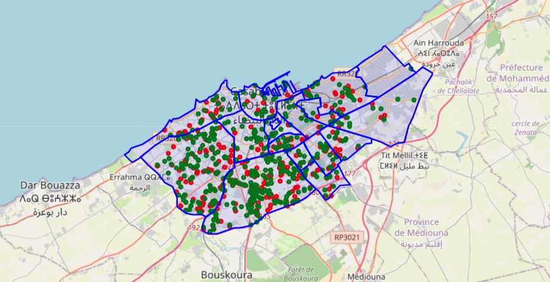
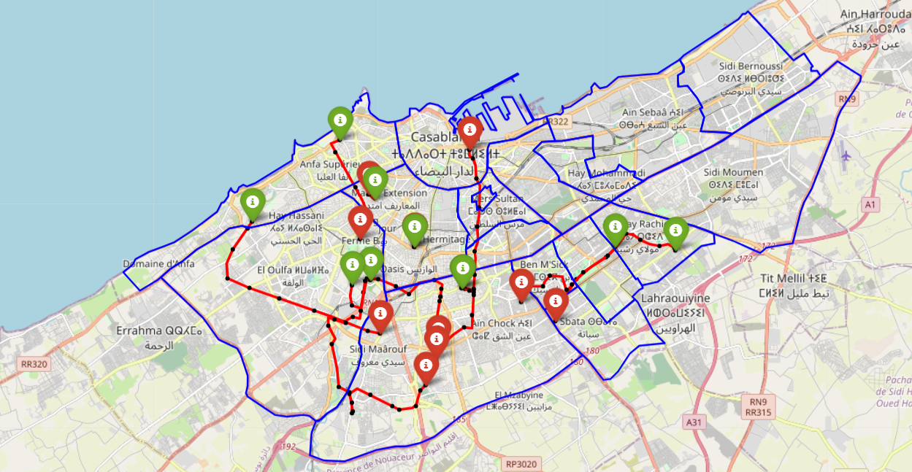
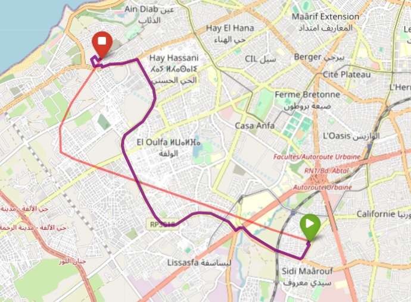

# Geospatial Remapping & Map Matching

This module is responsible for transforming Porto taxi trajectories into realistic Casablanca mobility data for the TaaSim simulation platform.

It explores multiple geospatial transformation and map-matching strategies to generate coherent urban mobility trajectories aligned with Casablanca’s road network and administrative boundaries.

---

# Objectives

The main goals of this module are:

- Transform Porto GPS trajectories into Casablanca coordinates
- Preserve realistic mobility density patterns
- Filter geographically inconsistent trips
- Reconstruct realistic vehicle paths on Casablanca roads
- Generate simulation-ready mobility datasets

---

# Repository Structure

```text
zone_remapping/
    ├── Zone_Remaping_Map_Matching.ipynb
    ├── README.md
    │
    ├── visuals/
    │   ├── porto_distribution.png
    │   ├── bounding_box_result.png
    │   ├── geojson_filtering_markers.png
        ├── geojson_filtering_trips.png
    │   ├── map_matching_osmnx.png
    │   └── map_matching_osrm.png
    │
    └── outputs/
        ├── casablanca_dataset.parquet

data/
└── geojson/
    ├── Arrondissements.geojson
```

---

# Geospatial Remapping

The original Porto taxi dataset was transformed into a synthetic Casablanca mobility dataset using several successive approaches.

The goal was to balance:

- geographic realism
- trajectory consistency
- dataset volume preservation

---

# Approach 1 — Bounding Box Transformation

## Principle

A simple linear transformation was applied to map Porto GPS coordinates into Casablanca coordinates using bounding box scaling.

No spatial validation was performed.

---

## Advantages

- Simple implementation
- Fast execution
- Useful for initial large-scale visualization
- Preserves global trajectory distribution

---

## Limitations

- Numerous points outside Casablanca boundaries
- Unrealistic trajectories crossing oceans or rural areas
- No urban consistency validation
- Low geographical realism

---

# Approach 1 Improved — Bounding Box + Filtering

## Principle

The initial bounding-box transformation was enhanced with spatial filtering:

- coordinate clamping
- outlier removal
- bounding-box validation

---

## Advantages

- Reduces extreme outliers
- Improves visual consistency
- Produces cleaner trajectory distributions

---

## Limitations

- Mobility zones remain artificial
- Uniform 4×4 grid approximation
- Does not reflect real Casablanca districts
- Some trajectories remain partially invalid

---

# Approach 2 — GeoJSON-Based Remapping

## Principle

A GeoJSON file containing real Casablanca administrative districts was integrated into the pipeline.

Spatial filtering was performed using polygon containment tests:

```python
point ∈ Casablanca
```

Only trajectories fully compatible with Casablanca urban boundaries were retained.

---

## Advantages

- Geographically realistic results
- Accurate urban boundary alignment
- Real district-based mobility simulation
- Professional geospatial workflow
- Improved trajectory coherence

---

## Main Limitation

Strict filtering removed a large portion of trajectories:

- ~20% of trips retained
- significant dataset volume reduction

This introduces a tradeoff between:

- dataset quantity
- geographic realism

---

# Remapping Conclusion

The Bounding Box approach enables fast large-scale simulation but remains geographically approximate.

Adding filtering improves consistency while still relying on artificial spatial partitioning.

The GeoJSON-based approach provides the most realistic and professionally aligned solution, producing trajectories coherent with real Casablanca administrative boundaries.

However, this realism comes at the cost of substantial data reduction due to strict spatial filtering.

---

# Future Improvements

Potential future enhancements include:

- relaxing strict filtering constraints
- retaining trajectories mostly inside Casablanca
- synthetic trip augmentation
- density-aware remapping
- adaptive zone balancing
- geospatial interpolation techniques

---

# Map Matching

After remapping, several map-matching strategies were explored to reconstruct realistic vehicle paths over Casablanca’s road network.

The objective was to align noisy GPS points with actual roads and generate coherent mobility trajectories.

---

# Approach 1 — OSMnx + NetworkX

## Principle

This approach uses:

- GPS projection onto the road network
- shortest-path computation between consecutive points

using:

- OSMnx
- NetworkX

---

## Advantages

- Simple architecture
- Fast execution
- Easy local deployment
- Lightweight pipeline

---

## Limitations

- Zigzag artifacts
- Unrealistic detours
- No global trajectory optimization
- Sensitive to noisy GPS points

---

# Approach 2 — OSRM-Based Matching

## Principle

The OSRM-based strategy generates multiple road candidates for each GPS point and reconstructs the globally most coherent trajectory.

The algorithm evaluates:

- spatial proximity
- transition consistency
- routing coherence

---

## Additional Improvements

Several enhancements were tested:

- adaptive GPS sampling
- trajectory segmentation
- start/end correction
- route smoothing

---

# Results

The OSRM-based approaches produced:

- smoother trajectories
- more stable paths
- realistic routing behavior
- better alignment with Casablanca roads

Compared to graph-based shortest-path methods, OSRM significantly improves trajectory realism and urban coherence.

---

# Engineering Concepts Explored

This module explores several advanced geospatial and data engineering concepts:

- GPS coordinate transformation
- Spatial filtering
- Polygon containment tests
- GeoJSON processing
- Synthetic mobility generation
- Road-network graph analysis
- Shortest-path routing
- Map matching
- Geospatial validation
- Urban mobility simulation

---

# Technologies Used

| Category | Technologies |
|---|---|
| Geospatial Processing | GeoPandas, Shapely |
| Visualization | Folium, Matplotlib |
| Road Networks | OSMnx, NetworkX |
| Routing | OSRM |
| Data Processing | Pandas, PySpark |
| Data Formats | GeoJSON, CSV |

---

# Outputs

Generated artifacts include:

- remapped Casablanca trajectories
- validated urban trips
- matched road-network routes
- mobility heatmaps
- district-level trajectory visualizations

---

# Current Status

## Completed

- Porto dataset exploration
- Coordinate remapping prototype
- GeoJSON spatial filtering
- OSMnx map matching
- OSRM route reconstruction
- Trajectory visualization

## In Progress

- Density preservation optimization
- Synthetic trajectory augmentation
- Adaptive filtering strategies

## Planned

- Real-time GPS simulation
- Dynamic traffic modeling
- Distributed geospatial processing
- Streaming map matching

---

# Visualizations

## Bounding Box Transformation


## GeoJSON District Filtering


## GeoJSON District Filtering


## OSRM Map Matching


---

# Key Insight

This work highlights an important engineering tradeoff in mobility simulation systems:

> Higher geographic realism generally reduces usable data volume.

Designing scalable urban mobility platforms therefore requires balancing:

- realism
- scalability
- computational cost
- dataset coverage
- trajectory consistency